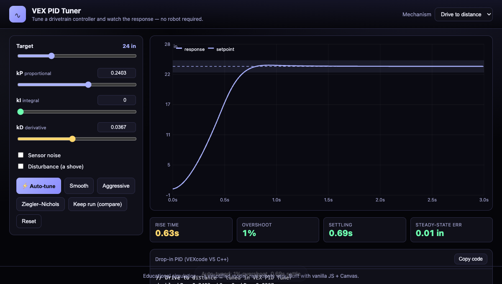

# VEX PID Tuner + Field Planner

Two tools in one browser app, no robot required:

1. **PID Tuner** — tune a drivetrain controller and watch the closed-loop
   response in real time.
2. **Field Planner** — a top-down VEX V5 field with a coordinate grid, a
   draggable/rotatable robot outline, and clickable waypoints (straight or
   smooth curved paths). **Run path** drives the robot along the route with a
   pure-pursuit follower and plots live **cross-track error**.

The tuner exports gains in your template's format: **VEXcode V5**, **LemLib**,
**JAR-Template**, or a generic PID struct.

**▶ Live demo:** _deploy to GitHub Pages / Netlify (see below)_



## What it does

- **Two mechanisms:** *drive to distance* and *turn to heading* (position control
  with realistic momentum, a static-friction deadband, and ~20–30 ms loop delay).
- **Live response chart** — setpoint, response, the 5% settling band, and a
  disturbance marker — redrawn instantly as you drag the **kP / kI / kD** sliders.
- **Tuning metrics:** rise time, overshoot %, settling time, steady-state error,
  color-coded so you can see what "good" looks like.
- **Sensor noise + disturbances** — inject encoder/gyro noise and a mid-run shove
  to see how kI and kD react.
- **Auto-tune** — a cost-based grid search that minimizes settling time +
  overshoot + steady-state error.
- **Presets** — Smooth, Aggressive, and a real **Ziegler–Nichols** tune (finds the
  ultimate gain Kᵤ and period Tᵤ from a sustained-oscillation search).
- **Copy code** — exports your gains as a drop-in VEXcode V5 C++ PID loop.

## How the model works

A motor command `u ∈ [-1, 1]` drives a first-order velocity plant
(`dv/dt = u·aMax − v·aMax/vMax`, so `u = 1 → v → vMax`) whose integral is position.
A static-friction deadband means tiny efforts can't move the robot — so a P-only
loop stops short of the target (steady-state error), which is exactly why you add
kI. A small sensor/loop **delay** makes high kP oscillate, just like a real robot,
and makes the Ziegler–Nichols method meaningful. Derivative is taken on the
measurement (no setpoint kick), with integral anti-windup.

It's a teaching model — simplified, but it reproduces the behaviors you actually
tune against on a VEX robot.

## Project layout

```
index.html     Page shell (Tuner / Field tabs)
style.css      Theme + layout
src/sim.js     Physics + PID + metrics + auto-tune + Ziegler–Nichols (pure, testable)
src/field.js   Top-down field: coordinate grid, robot outline, waypoint path
src/main.js    UI wiring, Canvas chart, presets, code export, tab switching
```

## Field Planner

A 12'×12' field (24" foam tiles) with a centre-origin coordinate grid (inches).
Click to drop waypoints, drag the robot or any point to move it, drag the
robot's nose to rotate, double-click a point to delete, and **Copy waypoints**
to export the path as a C++ array. Snap-to-grid (6") optional.

## Run locally

Pure static site, no build step:

```bash
npm run serve      # python3 -m http.server 8010
# open http://localhost:8010
```

## Deploy

Static — host anywhere. For GitHub Pages: push to a repo, then
**Settings → Pages → Deploy from a branch → main / root**.

## Caveats

Educational simulation; a real drivetrain has effects this model omits (slip,
battery sag, per-side dynamics). Use it to build intuition and a starting tune,
then verify on the robot.
